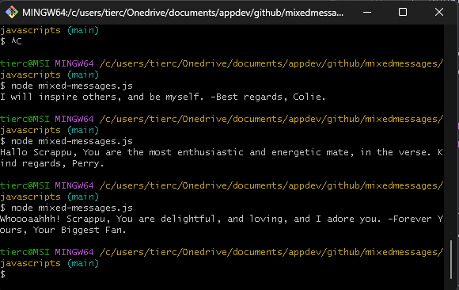
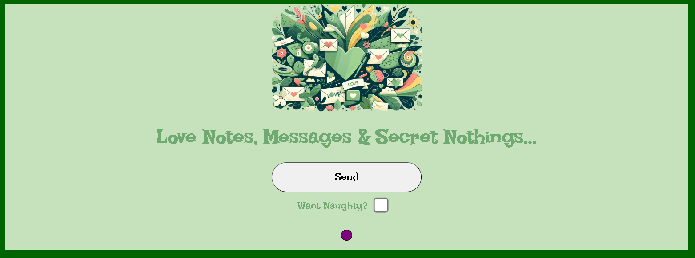

# MixedMessages

- Mixed MEssages is an assignment I received from [CodeCademy](https://www.codecademy.com/).

## Overview

>For this project, you will build a message generator program. Every time a user runs a program, they should get a new, randomized output. You’re welcome to take the project in a couple of different forms, like an astrology generator, inspirational message, or nonsensical jokes. To make your program truly random, the message that it outputs should be made up of at least three different pieces of data. Take what you know of JavaScript syntax so far to build the program and customize it to your liking.

Project Objectives:
- Build a message generator program using JavaScript
- Use Git version control
- Use command line
- Develop locally on your computer

Prerequisites:
- JavaScript
- Git and GitHub
- Command line

# Note

I am developing this with the intent of using the JavaScript on a web page with a button that displays the message generated by the script. There are two version in the repo of the script:

1. mixedMessages.js
    - HTML version
2. mixed-messages.js
    - Console version
    - node mixed-messages.js in git bash will execute
    - 

# Detailed Documentation

- [Design Documentation](./Documentation/design.md)

# Codecademy WorkSpace

- [mixedMessages.js](https://www.codecademy.com/workspaces/660588b0b846a99dc687fa86)

# HTML Interface
- [mixedMessages.html](mixedMessages.html)
- 
- 